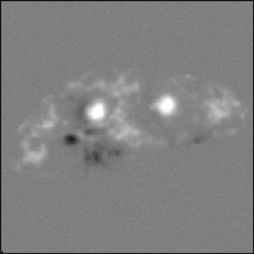
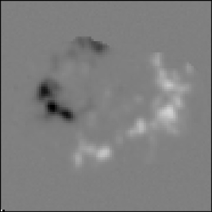
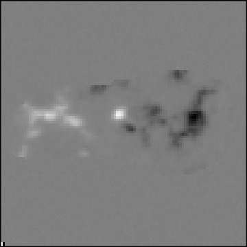

Pythia
======

Pythia is an open-source Python library for Solar Magnetic Active Region Data Analysis.
This library holds the principal work done as part of the [OpenAstonomy Google Summer of Code 2020 project](https://summerofcode.withgoogle.com/projects/#5503197600284672), 

[**Solar Weather Forecasting using Linear Algebra**](https://openastronomy.org/gsoc/gsoc2020/#/projects?project=space_weather_forecasting_using_linear_algebra)

Description
-----------
Space weather studies Sun-Earth interaction events. One of these, is the effect of solar flares have on our civilisation. The forecast of solar flares is not a solved problem, and many approaches have been tried. [Sunspotter](https://www.sunspotter.org/) is a citizen science project that asked volunteers to classify solar active regions by their complexity - as it’s believed complexity has a direct relationship with their activity.

The goal of this project is to develop a model for forecasting the likelihood that an Active Region on the sun would produce a solar flare in the near future. The dataset used in this project is the [Sunspotter dataset](https://zenodo.org/record/1478972#.XrUPH_HhU5l), which includes a complexity score for each AR. It is to be explored if the complexity of the AR corresponds to a higher probability of flare production. In the course of this project, a Search Events object capable of querying HEK and HELIO databases will be created.

Some Cool Active Region Images
------------------------------





Installation
------------

Use git to grab the latest version of Pythia:

    git clone https://github.com/Raahul-Singh/pythia.git

Done! In order to enable Pythia to be imported from any location you must make
sure that the library is somewhere in your PYTHONPATH environmental variable.
For now the easiest thing is to install it locally by running,
```
pip install -e .
```
from the directory you just
downloaded.


