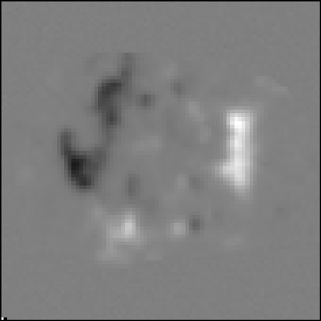

Pythia
======


Pythia is an open-source Python library for Solar Magnetic Active Region Data Analysis.
This library holds the principal work done as part of the [OpenAstonomy Google Summer of Code 2020 project](https://summerofcode.withgoogle.com/projects/#5503197600284672),

[**Solar Weather Forecasting using Linear Algebra**](https://openastronomy.org/gsoc/gsoc2020/#/projects?project=space_weather_forecasting_using_linear_algebra)

The mentors for this project were:

@**dpshelio**

@**mbobra**

@**drsophiemurray**

@**samaloney**

Description of the work done
----------------------------

## 1 ) The Search Events Object

Often we find data representing the same observed physical phenomenon to have slightly different values when the data comes from different sources.
This could be due to noise or different choices of parameters for the preprocessing techniques employed.
This creates problems when the two datasets need to be compared, and /or may data exclusive to them.
We faced this problem when the data from NOAA that characterizes the Active Regions was not available in the Sunspotter dataset.
Although the observations were identical, they were not exact.
Their multidimensional nature also prevented matching by simple sorting.

In my repository, Pythia, we created a general Search Events Table Matching algorithm that would solve this problem.
Although it is general enough to be used with any tabular dataset, we do plan on making it more ‘intelligent’ so as to require minimal preprocessing from the user.

## 2) The Flare Forecasting

After significant preprocessing, we were able to get a good enough dataset to feed to our deep learning pipeline.
We wanted to predict if an Active Region would flare in the first six hours from its observation or not.
We were inspired by architectures, popular in academia in the domain of flare forecasting, Though our approach was the first to combine modern Deep Learning techniques for building our Convolutional Nets.

With some PyTorch magic, we were able to get a prediction accuracy of around 84% on the test set in the binary classification of whether an active region would flare or not. A study of flare forecasting using Machine learning in a fixed time frame from observation is unique in itself.

We implemented an Autoencoder to get a low dimensional representation of the Active Regions, so that they may be used with other scalar measurements.

We also were curious to see if the absolute orientation of the Active regions with respect to the sun was of any significance in the Active Region’s flaring activity.
While we were expecting a connection, we were surprised to see that the orientation mattered more in the case where the Active Region did flare than in the case where it did not. More work is required before we can quantitatively state our findings on this front.
 
## 3) Pythia

What began as a project to analyze the Sunspotter dataset, has grown way beyond its original scope.
With the power of Pytorch Lightning and SunPy, Pythia is shaping out be a general-purpose Deep learning Toolkit for Solar Physics.

The barrier to entry for using Deep Learning in Solar Physics Research is quite high for people without the technical knowledge of Deep Learning and without the time to invest heavily into learning the many nuances of modern Deep Learning frameworks.

With Pythia, we plan on providing a SciKit Learn like interface, with the power and muscle of PyTorch and the elegance and order of Pytorch Lightning.
Although the expansion and generalization are still underway, with more use cases and help from the community, Pythia will surely help in making modern Deep Learning more accessible to the Solar Physics community.

Some Cool Active Region Images
------------------------------




Installation
------------

Use git to grab the latest version of Pythia:

    git clone https://github.com/Raahul-Singh/pythia.git

Done! In order to enable Pythia to be imported from any location you must make
sure that the library is somewhere in your PYTHONPATH environmental variable.
For now the easiest thing is to install it locally by running,
```
pip install -e .
```
from the directory you just
downloaded.
